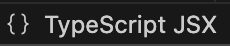
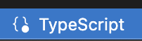
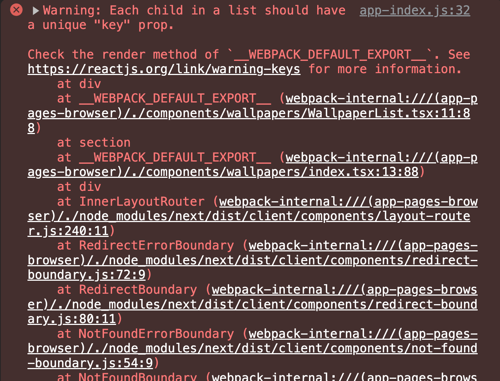
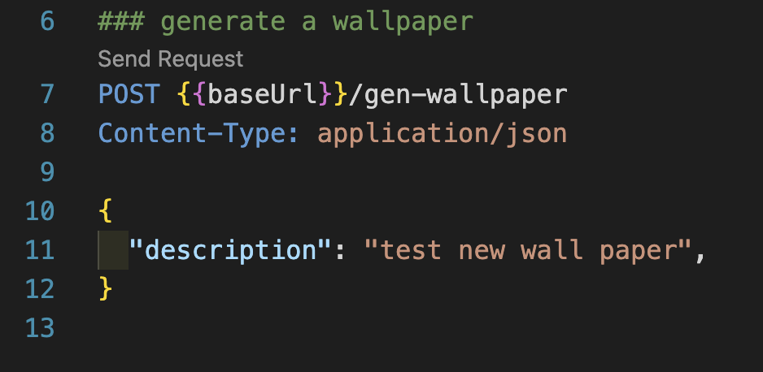
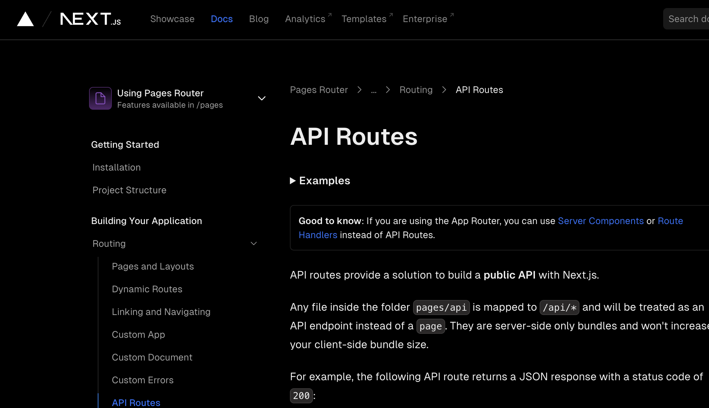
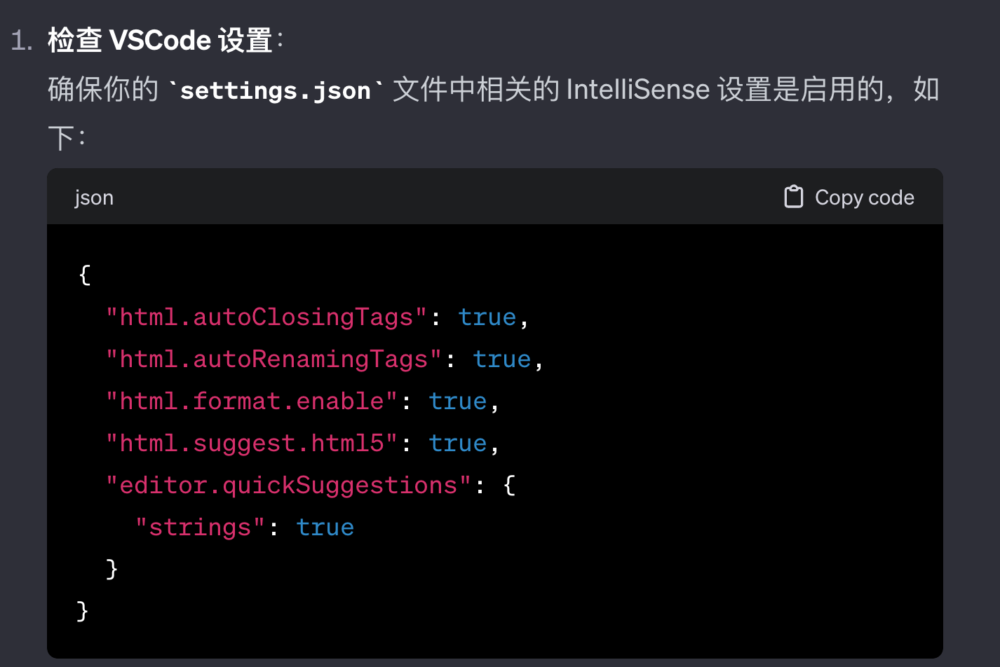

# 项目课程笔记

生产环境项目地址: AI Wallpaper https://aiwallpaper.shop/

## 2024.1.10 Lesson 1

### 学习目标

* 熟悉项目结构以及每个文件都是干嘛的
* 调用OpenAI image API生成图片
* 前后端数据整合 前端输入prompt 后端用prompt生成图片
* UI组件库美化页面

### 工具

* VS Code 插件

  * REST Client -> 进行local debugging发送请求给后台

  * Tailwind CSS IntelliSense -> 自动提示tailwind 类名

### 开发流程

1. 加一个`gen-wallpaper` api 

   1. 先用mock数据
   2. 后台 和Open AI image API进行通信
   3. 前后端整合 
      1. 前台输入prompt 
      2. 后端获取prompt并发送 
      3. 发完API拿到结果 + 返回前台展示

2. 写一个展示的接口 `get-wallpapers`

   1. 先用mock data
   2. 用前端call 后端展示mock data 

3. 美化页面 

   1. https://ui.shadcn.com
   2. https://tailspark.co/components

4. 增加数据流管理自动将新的壁纸展示到页面

   

### 知识点

* App router 的概念 使用app folder 来创建 页面 和 api
  * 如果是写页面 默认入口是page.tsx  直接加folder 就行  `app/blog/page.tsx`
  * 如果是写api 默认入口是route.tsx 在api folder里面 再加folder  `app/api/gen-wallpaper/route.tsx`
* App Router的写法是在Next.js 13 新加入的 https://nextjs.org/blog/next-13-4 
* 服务器渲染和客户端分离 两种不同的数据请求处理方式 根据具体的使用场景来确定用哪种方式
  * 服务端渲染 vs. 前后端分离
    * 服务端渲染
      * SEO更高效

    * 前后端分分离 
      * 方便分工合作

* 用一个全局的global 变量来存所有的wallpapers, 在Input里面修改数据, Wallpapers中重新call api来写数据
* 需要用`"use client"` 来写客户端组件 在function 里面做fetch data 操作 并且  用useState来记录?? 
* 在components 文件夹里面是用index.tsx作为入口
* 如何查看我使用的node js 版本?  `node -v`

### Debug&踩坑

* OpenAI image API 生成的图片会过期(生成数据之后的几个小时之内)

* VS Code Typescript自动补全不好用的话 看看是不是partial mode 通过右下角标记

  * OK:  

  * 多了个点表示Something wrong : 

* apitest.http 当中的baseUrl 没有`""`   否则会报错connection failure

* `###` 开头才有Send Request选项

* 为什么用export default function 定义api 就会报错?

* 指定一个key来避免报错

  

  

* json中的最后一个字段不能加多余的逗号 加了就变成double quote error了 ` SyntaxError: Expected double-quoted property name in JSON` 

* 注意官方文档左上角的pages router 和 app router 不同版本区别 这个项目用的是App Router

## 经验&心得

* 注意区分哪一些是可以抄的 哪一些必须要自己写 

  * 抄的话? 从哪里抄 怎么抄 

  * 写的话? 为什么抄不了 怎么写 写哪一部分 

* 新加进来的组件不要直接加到已有页面，先重新加一个新文件存着，同时保留新旧不同版本，最后新的组件调试好了之后再做替换

* 对于可能为null 的元素wallpapers.map()遍历之前必须做一下检查 

* 用到的类型不一致ts会报错

## Q&A:

* Q有一个vscode 设置的小问题，需要安装插件才能自动提示补全className吗?   

* A: 应该是自己的vscode 默认自动补全没设置好 加一个`suggest.html5` 好像就可以了

  

* Q: 在内部的index.tsx中的getData() function拿到的数据和 通过apitest.http 拿到的数据为什么是不一致的 ?

* A: 因为缓存的更新不及时

  

* Q: 为什么api 和 blog 会同时出现在app folder 之中?? 

* A: 看nextjs app Router 知识点

* Q: 为什么调整input 的宽度 直接更新div 中的className没变化? 

* A: 更外层的flex flex column 属性限制了宽度 注意找外面的限制

  

* Q: setLoading 是自带的么?  

* A: 只是一个State的setter函数

## 现在卡主的几个点

* 单项数据流的管理 React 中的State 和 Effect 怎么玩
* React Dispatch 
* Set state action 是干嘛的 ?

