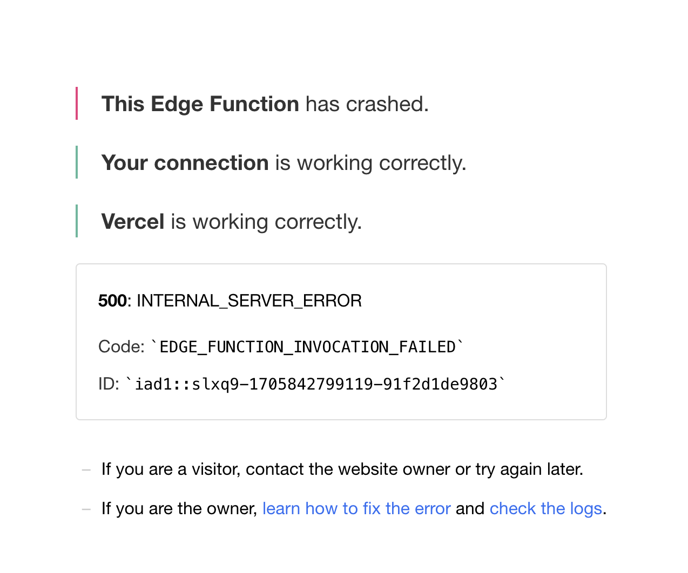

# 项目课程笔记

### 工具

- VS Code 插件
  - REST Client -> 进行 local debugging 发送请求给后台
  - Tailwind CSS IntelliSense -> 自动提示 tailwind 类名

生产环境项目地址: AI Wallpaper https://aiwallpaper.shop/

## 2024.1.10 Lesson 1

### 学习目标

- 熟悉项目结构以及每个文件都是干嘛的
- 调用 OpenAI image API 生成图片
- 前后端数据整合 前端输入 prompt 后端用 prompt 生成图片
- UI 组件库美化页面

### 开发流程

1. 加一个`gen-wallpaper` api

   1. 先用 mock 数据
   2. 后台 和 Open AI image API 进行通信
   3. 前后端整合
      1. 前台输入 prompt
      2. 后端获取 prompt 并发送
      3. 发完 API 拿到结果 + 返回前台展示

2. 写一个展示的接口 `get-wallpapers`

   1. 先用 mock data
   2. 用前端 call 后端展示 mock data

3. 美化页面

   1. https://ui.shadcn.com
   2. https://tailspark.co/components

4. 增加数据流管理自动将新的壁纸展示到页面

### 知识点

- App router 的概念 使用 app folder 来创建 页面 和 api
  - 如果是写页面 默认入口是 page.tsx 直接加 folder 就行 `app/blog/page.tsx`
  - 如果是写 api 默认入口是 route.tsx 在 api folder 里面 再加 folder `app/api/gen-wallpaper/route.tsx`
- App Router 的写法是在 Next.js 13 新加入的 https://nextjs.org/blog/next-13-4
- 服务器渲染和客户端分离 两种不同的数据请求处理方式 根据具体的使用场景来确定用哪种方式

  - 服务端渲染 vs. 前后端分离

    - 服务端渲染

      - SEO 更高效

    - 前后端分分离
      - 方便分工合作

- 用一个全局的 global 变量来存所有的 wallpapers, 在 Input 里面修改数据, Wallpapers 中重新 call api 来写数据
- 需要用`"use client"` 来写客户端组件 在 function 里面做 fetch data 操作 并且 用 useState 来记录??
- 在 components 文件夹里面是用 index.tsx 作为入口
- 如何查看我使用的 node js 版本? `node -v`

### Debug&踩坑

- OpenAI image API 生成的图片会过期(生成数据之后的几个小时之内)

- VS Code Typescript 自动补全不好用的话 看看是不是 partial mode 通过右下角标记

  - OK: 

  - 多了个点表示 Something wrong : 

- apitest.http 当中的 baseUrl 没有`""` 否则会报错 connection failure

- `###` 开头才有 Send Request 选项

- 为什么用 export default function 定义 api 就会报错?

- 指定一个 key 来避免报错

  

- json 中的最后一个字段不能加多余的逗号 加了就变成 double quote error 了 ` SyntaxError: Expected double-quoted property name in JSON`


- 注意官方文档左上角的 pages router 和 app router 不同版本区别 这个项目用的是 App Router


### 经验&心得

- 注意区分哪一些是可以抄的 哪一些必须要自己写

  - 抄的话? 从哪里抄 怎么抄

  - 写的话? 为什么抄不了 怎么写 写哪一部分

- 新加进来的组件不要直接加到已有页面，先重新加一个新文件存着，同时保留新旧不同版本，最后新的组件调试好了之后再做替换

- 对于可能为 null 的元素 wallpapers.map()遍历之前必须做一下检查

- 用到的类型不一致 ts 会报错

### Q&A

- Q 有一个 vscode 设置的小问题，需要安装插件才能自动提示补全 className 吗?

- A: 应该是自己的 vscode 默认自动补全没设置好 加一个`suggest.html5` 好像就可以了

- Q: 在内部的 index.tsx 中的 getData() function 拿到的数据和 通过 apitest.http 拿到的数据为什么是不一致的 ?

- A: 因为缓存的更新不及时

- Q: 为什么 api 和 blog 会同时出现在 app folder 之中??

- A: 看 nextjs app Router 知识点

- Q: 为什么调整 input 的宽度 直接更新 div 中的 className 没变化?

- A: 更外层的 flex flex column 属性限制了宽度 注意找外面的限制

- Q: setLoading 是自带的么?

- A: 只是一个 State 的 setter 函数

### Follow up

- 单项数据流的管理 React 中的 State 和 Effect 怎么玩
- React Dispatch
- Set state action 是干嘛的 ?
- server side 需要重新来一遍? 使用 page 来进行重复的加载 client side 可以直接 append ? 当前的 html 结构不变化

## 2024.1.17 Lesson 2 后台集成数据 + 部署

课程录像回放: https://meeting.tencent.com/user-center/shared-record-info?id=f2397f6e-67a0-4a1a-baf3-740cd38a3788&from=3

### 学习目标

- AWS S3 图片上传
- Supabase 数据库的读写
- Clerk 登录集成
- Vercel 部署

### 开发流程

- 添加 S3 的支持 当 call OpenAI image API 生成图片 返回结果中有 img_url 将这个 img_url 上传到 S3 存储桶保存

- 使用 clerk 进行用户管理 在 call api/gen-wallpaper 会被要求登录状态 来保护 api 不被滥用

- supabase 数据库保存所有的 wallpaper 以及 user 信息 防止网页刷新之后内容丢失

### AWS S3 图片上传

- 新账号注册 AWS 之后自动有 12 month free trial

- S3 相关的 Config 设置

  - Bucket Policy

  - CORS Pollicy 感觉这里后期会有坑? 拭目以待

- 在 IAM 控制台中设置安全凭证 credentials 然后 copy 到本地的`.env.local` 代码配置文件中 需要同时用到 Access Key 和 Service Key

- 文件名去重的一些思路

  - uuid 唯一识别

  - [Snowflake id](https://zhuanlan.zhihu.com/p/374667160) 订单号生成 snowid 生成唯一 id

  - md5 哈希算法(user id + id)

### Supabase 数据库

- 安装`node-postgres` 连接数据库的包

- 需要在安装了新的 package 之后再安装相对应的类型，类型包只是在 dev dependency 中存在 `pnpm add -D @types@pg` `-D` 表示是开发的依赖
- 用户第一次登录的时候需要上传信息到 supabase 后期会监听 user 信息的更新 如果有变化就再 update
- wallpapers 表中存的不是 Img 本身 而是 img_size, img_url, user_name 等信息

- 数据库的连接池 更高效处理数据 pg 中直接拿来用就行

- 用一个句柄来操作数据库

- 添加一个`models`文件夹专门进行数据库操作

### Clerk 登录

分析什么时候需要登录 哪些页面需要登录之后才显示 哪个 api 需要登录状态 哪些不需要

业界主流的几种不同方案选择

- 手写 Oauth2
- SDK / lib 混合逻辑
- 托管，登录/注册/验证/发验证码/风控 code, 外包给第三方 处理回调 登录态 = 快速上线托管
- `insertUser` 之前先判断用户是否已经在数据库中存在了 insert 和 update 是不同的两个操作
- cookie 是 clerk 在在登录跳转的时候就创建并保存到浏览器 session 之中的，后面要拿用户信息就可以直接用 currentUser() 读一下

### Vercel 部署

前置条件: 代码已经上传到了 github repo 中，可以是 private access

- 直接导入 git repo 然后线上 build + deploy
- 连接自己的 custom domain 需要把 vercel 的信息 加到 spacesquare 的 DNS 上面

### Code Examples

1. Ajax 和 server side render 在代码组织上的区别

```tsx
export default function Home() {

  const fetchSomeData = ...

  // useEffect 是在组件已经挂载事件之后 再调用
  useEffect(() => {
    fetchSomeData();
  })

  return {
    <div>
    	<Header />
      ...
    </div>
  }
}
```

2. S3 存储桶策略

```json
{
  "Version": "2012-10-17",
  "Statement": [
    {
      "Effect": "Allow",
      "Principal": { "AWS": "arn:aws:iam::Account-ID:user/UserName" },
      "Action": ["s3:GetObject"],
      "Resource": ["arn:aws:s3:::bucket-name/*"]
    }
  ]
}
```

### Debug&踩坑

- 在 vercel deployment 之前可以本地 run `yarn run build` 来看一下能不能 Build 成功
  - build 上线之前的 format 问题被 ESLint 抓到了 每个 Component 都需要有 function name
- 在 vercel 上记得复制粘贴环境变量 添加权限



### 经验&心得

- `.env.local`文件在默认情况下会被 git 忽略 但是 `.env`文件是没有被 git 忽略的
- `curl https://ipinfo.io` 可以直接 call 这个网站来检查 IP 出口的地址
- vercel 后台的 log 可以帮助定位线上后台的 bug

### Q&A:

Q: global.css 和 tailwind css 的区别?

A: global css 就是一个全局的样式文件 里面 import 了 tailwin css 所以可以再每个页面都使用 tailwind css 新建一个 style.css

### Follow up

- 如果重复给出相同的 prompt 会有重复的图片，S3 似乎默认的策略是直接覆盖? 需要 verify
- vercel timeout issue https://github.com/vercel/vercel/discussions/4502

## 2024.1.17 Lesson 3 Stripe 支付集成

### 学习目标 **Goal**

- 完成 Stripe 的集成
- Stripe 支付逻辑的处理

在 Test mode 的时候会有专门用来 test 的信用卡

`models/order.ts`

`services/order.ts`

`types/order.d.ts`

组件加载的时候可以调用

前端客户端不能够 需要直接用到

下单页面

支付页面跳转

支付之后后台数据库需要记录 credits 的生成记录

在跳转之前做一个 check

生成之后进行动态跳转

状态管理 + 动态加载的部分

待支付订单的状态

同步 callback + 异步 webhook 同时支持

微信支付付款码贴在那 很难自动化了
